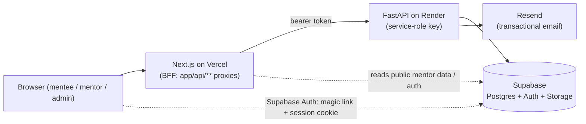
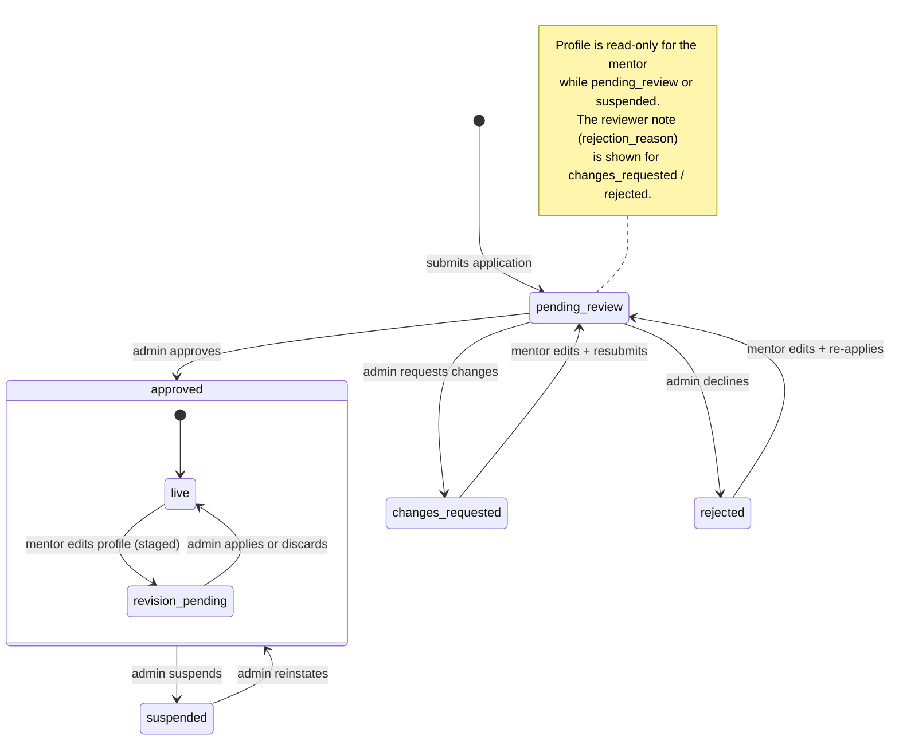
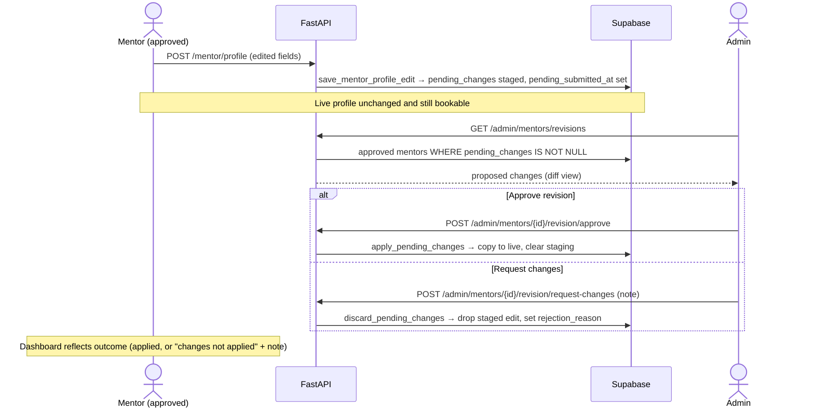
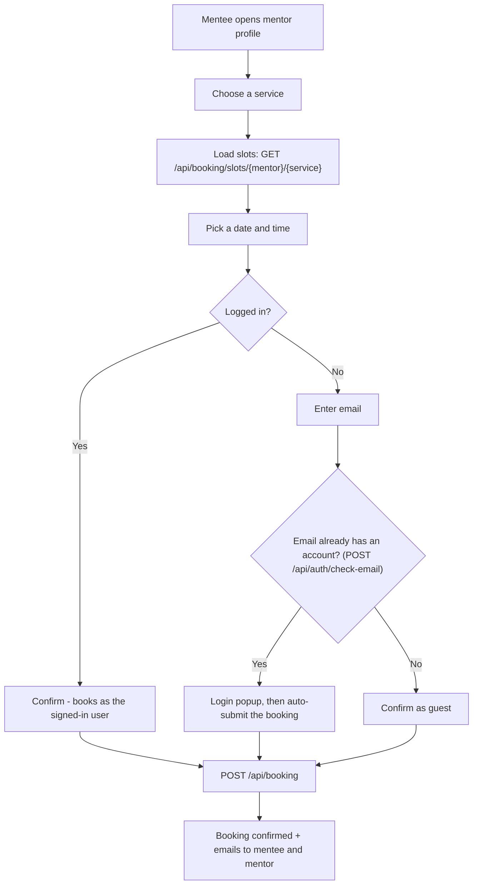

# Groovia / Immigroov — System Flows

Living reference for the interdependent flows in the platform (mentor lifecycle, admin
review, revisions, booking). Diagrams are written in **Mermaid** (diagrams-as-code) so
they live in version control, diff in pull requests, and can be edited by anyone.

> Keep these in sync with the code. When you change a status, an endpoint, or a
> transition, update the relevant diagram in the same PR.

## How to view and edit

- **GitHub**: renders ` ```mermaid ` code blocks automatically — just open this file.
- **VS Code**: install the *Markdown Preview Mermaid Support* extension, then open the
  Markdown preview.
- **Live editor**: paste a diagram into <https://mermaid.live> to edit it visually and
  export PNG/SVG.
- **Export from CLI**: `npx @mermaid-js/mermaid-cli -i FLOWS.md -o flows.pdf`.

Authoritative sources in code:
- Mentor status enum: `migrations/testing_db_setup.sql` (`mentor_status`)
- Status transitions: `db/mentors.py` (`set_mentor_status`, `save_mentor_profile_edit`,
  `apply_pending_changes`, `discard_pending_changes`)
- Admin actions: `routers/admin.py` · Mentor actions: `routers/mentor.py`

---

## 1. System context (who talks to whom)



The frontend never calls the backend directly from the browser: every call goes through
a `app/api/**` BFF route that attaches the user's bearer token. The backend uses the
Supabase service-role key and is the only tier that writes privileged data.

---

## 2. Mentor status lifecycle (state machine)

The core of the interdependence: a mentor row moves between these states, driven by
either the mentor or an admin. `pending_changes` is a *staged revision* on an already
`approved` mentor — the live profile keeps serving while the edit waits for review.



Editing rules by state (`db/mentors.py::save_mentor_profile_edit`):

| State | Can the mentor edit? | Where do edits go? |
|---|---|---|
| `pending_review` | No (locked) | — |
| `suspended` | No (locked) | — |
| `changes_requested` | Yes | live row → resubmits (`→ pending_review`) |
| `rejected` | Yes | live row → re-applies (`→ pending_review`) |
| `approved` | Yes | `pending_changes` (staged); live stays up |

---

## 3. New application review (sequence)

```mermaid
sequenceDiagram
    actor M as Mentor
    participant FE as Next.js (BFF)
    participant BE as FastAPI
    participant DB as Supabase
    participant EM as Resend
    actor A as Admin

    M->>FE: Submit onboarding form
    FE->>BE: POST /mentor/signup
    BE->>DB: create mentor (status = pending_review)
    BE-->>EM: mentor_application_received
    BE-->>FE: 201 { id }
    Note over M: Dashboard shows "under review"; profile locked

    A->>FE: Open Admin → Review tab
    FE->>BE: GET /admin/mentors/pending
    BE->>DB: list pending
    BE-->>A: pending applications (photo + full detail)

    alt Approve
        A->>BE: POST /admin/mentors/{id}/approve
        BE->>DB: status = approved
        BE-->>EM: mentor_approved + welcome_mentor
    else Request changes
        A->>BE: POST /admin/mentors/{id}/request-changes (note)
        BE->>DB: status = changes_requested, rejection_reason = note
        BE-->>EM: mentor_changes_requested
    else Decline
        A->>BE: POST /admin/mentors/{id}/reject (note)
        BE->>DB: status = rejected, rejection_reason = note
        BE-->>EM: mentor_rejected
    end
    Note over M: Sees result + reviewer note; if changes_requested / rejected,<br/>edits and resubmits → back to pending_review
```

---

## 4. Approved-mentor profile revision (sequence)

The "edit a live profile" loop. The public profile is never taken down; the edit is
staged and reviewed separately from the mentor list.



---

## 5. Booking a session (flowchart)



> **Future:** payment sits between "Confirm" and `POST /api/booking`. When it lands,
> add a `Pay` node on the confirm path and a `payment.succeeded` webhook branch — the
> rest of the flow is unchanged.

---

## Keeping diagrams honest

A diagram that drifts from the code is worse than none. Two habits keep them accurate:

1. **Change the diagram in the same PR as the flow.** Treat it like a test.
2. **Name real endpoints and DB functions** (as above) so a reader can jump from the
   diagram straight to the code.
